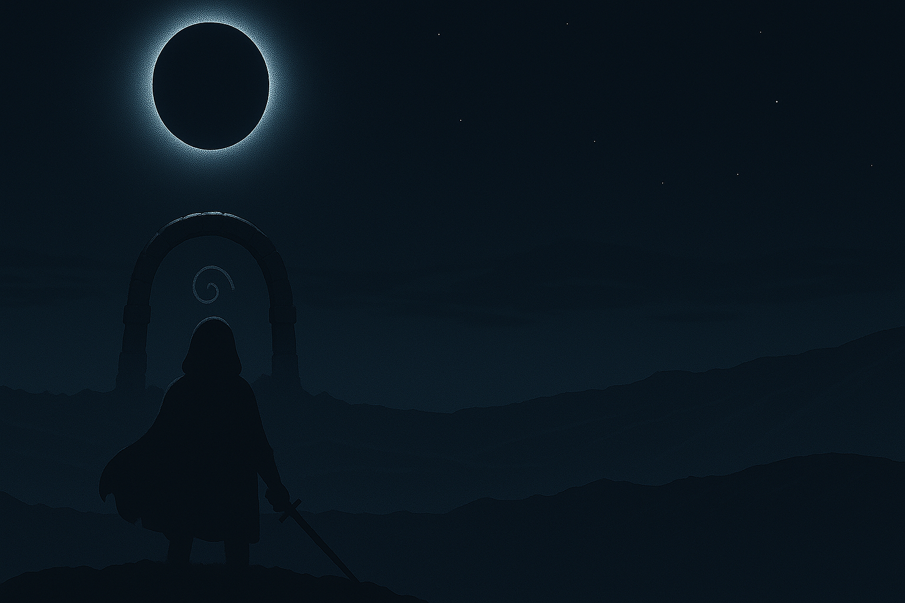

    

# 🌑 Callisto’s Trial

**Callisto’s Trial** is a brutal, atmospheric action roguelike set in a broken solar system lost to time. You are **Orion**, the sealed son of Callisto, chosen by the gods to face the Trial and uncover the truth of your bloodline — but not everything is as it seems.

Designed with purposefully difficult encounters, modular storytelling, and zero filler, the game draws inspiration from **Hades**, **Hyper Light Drifter**, and **Celeste**. Built in **PolarisKit**, it focuses on tight gameplay, handcrafted rooms, and elegant, symbolic progression.

---

## ⚔️ Core Features

- **Elite Rooms Only** – No filler. Every encounter matters.  
- **Scene Stack Engine** – Modular cutscenes and state transitions with persistent save data.  
- **Zero Tutorials** – No narration. No hand-holding. All story is learned through play.  
- **Crescent Combat** – A blend of precision dodging, swordplay, and lunar resource management.  
- **Dynamic HUD** – A solar eclipse visual system represents health, stamina, and death.  
- **Modular Cutscenes** – All narrative is delivered through environment and discovery.

---

## 🌌 World Overview

- **Threnos** – The hub world, cold and mournful. Your base between runs.  
- **The Trial** – A gauntlet of 10–20 elite rooms per floor, handcrafted for cruelty and purpose.  
- **Cindros** – The shattered moon. A post-game dungeon where the true weapon is forged.  
- **Nytherra** – The forgotten solar system, home to Callisto, Orion, and the gods.

---

## 🔥 Key Characters

- **Orion** – The player character. Stoic, sealed for centuries, unaware of the trap ahead.  
- **Callisto** – [Redacted]
- **Aetherion** – [Redacted]  
- **Orrin** – [Redacted]

---

## 🌠 Narrative Progression

- No safe rooms.  
- No exposition.  
- You begin with a symbol and a sword. The rest must be earned.

### Major Milestones

- **Unlock Orrin** by [Redacted]
- **Recover Orion’s Shards** to [Redacted]
- **Defeat [Redacted]** under enhanced conditions to earn [Redacted]
- **Forge [Redacted]** to [Redacted]

---

## 🗡️ Weapons & Powers

- **Starting Weapon:** A glowing crescent blade left at the gate.  

---

## 🌘 The Eclipse System (HUD)

- ☀️ **Sun** = Health  
- 🌙 **Moon** = Stamina  
- A **Total Eclipse** = Death

Your HUD is not just visual — it is the world watching you.

---

## 🏆 Post-Game Content

- Multiple endings. One truth.

---

## 🎨 Art & Sound

- Retro-pixel art with hand-animated sprites and cosmic palettes.  
- Dynamic color shifts during lunar phases and eclipse moments.  
- Atmospheric synth and ambient score with evolving motifs for each floor and boss.

---

## 📦 Collector's Edition (Coming Soon)

- **Callisto’s Trial Logo Pin**  
- **Orion Emblem Pins**  
- **Postcards**
- **Final Weapon Collectible**
- **Vinyl OST**
- **Game Cartridge Replica**

---

## 🧠 Credits

- **Developer:** Marco Gonzalez  
- **Framework:** PolarisKit  
- **Narrative, Design, Code:** N/A  
- **Pixel Art & Music:** (Coming Soon)

---

## 💬 Feedback

Have thoughts?  
We welcome playtesters, critics, and lore theorists.  
Reach out via [GitHub](https://github.com/marcogonzalez99) or open an issue to shape the Trial.

---

## Built By

Marco @ **SB Studios**  
[GitHub](https://github.com/marcogonzalez99) · [LinkedIn](https://www.linkedin.com/in/marco-a-gonzalez99)

---